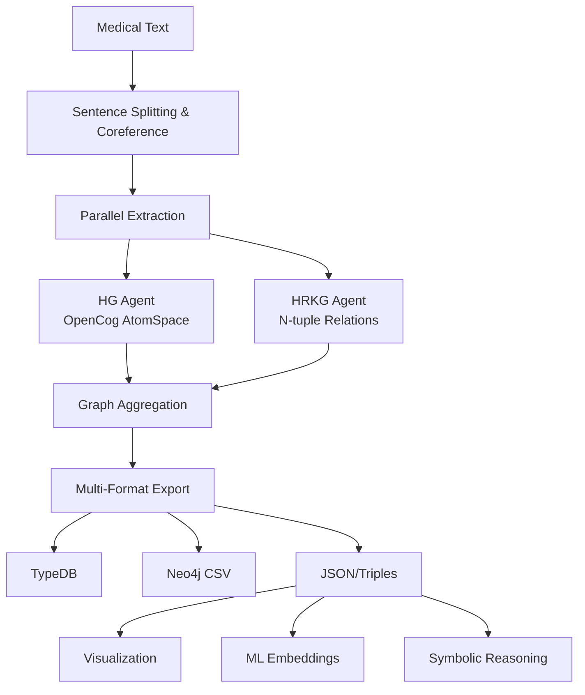

# 🏥 Healthcare Knowledge Graph Extraction System

[](https://www.python.org/downloads/)
[](https://openai.com/)
[](https://typedb.com/)
[](https://neo4j.com/)
[](https://opencog.org/)
[](https://pykeen.github.io/)
[](https://spacy.io/)

> **Transform unstructured medical literature into structured, queryable knowledge graphs for Clinical Decision Support Systems (CDSS)**

A sophisticated AI-powered pipeline that extracts structured knowledge from medical text, producing dual graph representations optimized for both symbolic reasoning and machine learning applications in healthcare. The system generates OpenCog AtomSpace hypergraphs and N-tuple hyper-relational knowledge graphs from biomedical literature.

## 🌟 Key Features

- **🤖 Dual AI Extraction**: Parallel generation of OpenCog AtomSpace hypergraphs and N-tuple hyper-relational knowledge graphs
- **🏥 Healthcare-Optimized**: Specialized for medical entities, drug interactions, and clinical relationships
- **⚡ Parallel Processing**: Concurrent sentence-level extraction with intelligent aggregation
- **🔄 Multi-Format Export**: TypeDB, Neo4j CSV, JSON, MeTTa and Freebase triple formats
- **📊 Rich Visualizations**: Interactive Pyvis graphs with NetworkX analysis
- **🧠 ML Integration**: PyKEEN embeddings and neural query interfaces
- **🔍 Symbolic Reasoning**: OpenCog AtomSpace integration for causal inference
- **📈 Temporal Modeling**: Time-aware relationships with provenance tracking

## 🌟 Key Integrations

### 🧠 AI & Machine Learning Frameworks
- **🤖 OpenAI GPT-4.1** - Advanced language model for intelligent knowledge extraction from biomedical texts
- **🔬 spaCy + SciBERT** - Specialized biomedical NLP pipeline with scientific language understanding
- **🧮 PyKEEN** - State-of-the-art knowledge graph embedding training with 30+ algorithms (TransE, ComplEx, RotatE)
- **⚡ PyTorch** - Deep learning backend powering neural components and embedding models

### 🗄️ Graph Database Ecosystems
- **📊 TypeDB** - Strongly-typed graph database with native support for complex n-ary relationships and inheritance
- **� Neo4j** - Industry-standard graph database with Cypher query language and CSV bulk import
- **🌐 NetworkX** - Comprehensive graph analysis library with 500+ algorithms for centrality, clustering, and pathfinding
- **📈 HypernetX** - Advanced hypergraph analysis for modeling complex multi-way relationships

### 🎯 Symbolic Reasoning & Knowledge Representation
- **🧠 OpenCog AtomSpace** - Hypergraph-based knowledge representation with probabilistic truth values
- **🔮 Hyperon** - Next-generation OpenCog with MeTTa language for symbolic-neural integration
- **🗣️ NeuroSpace** - Natural language query interface enabling conversational knowledge discovery
- **⚛️ MeTTa Format** - Functional programming language for expressing complex logical relationships

### 🎨 Visualization & Analytics
- **🌐 Pyvis** - Interactive network visualization with physics simulation, clustering, and real-time manipulation
- **� Plotly** - Professional-grade interactive charts and dashboards for knowledge graph analytics
- **🎯 Graphviz** - High-quality static graph layouts for publication-ready visualizations
- **� Matplotlib/Seaborn** - Statistical plotting for embedding analysis and performance metrics

### 🔧 Development & Infrastructure
- **⚡ UV Package Manager** - Ultra-fast Python dependency resolution and virtual environment management
- **🔒 Pydantic v2** - Type-safe data validation with automatic JSON schema generation
- **🧪 FastCoref** - State-of-the-art coreference resolution for improved entity linking
- **🔄 Asyncio** - Asynchronous processing for concurrent sentence-level extraction

## 🚀 Quick Start

### Prerequisites

```bash
# Python 3.10+ required
python --version

# Install UV package manager (recommended)
curl -LsSf https://astral.sh/uv/install.sh | sh
```

### Installation

```bash
# Clone the repository
git clone https://github.com/aibrite/healthcare-cdss-research.git
cd healthcare-cdss-research/knowledge-graph

# Option 1: Using UV (recommended)
uv sync

# Option 2: Using pip
pip install -r requirements.txt

# Download spaCy SciBERT model (required for biomedical NLP)
python -m spacy download en_core_web_sm

# Set up OpenAI API key
export OPENAI_API_KEY="your-api-key-here"
```

### Basic Usage

```bash
# Extract knowledge graphs from medical text
echo "Vemurafenib (150mg) showed 60% reduction in tumor volume in BRAF V600E-mutant melanoma patients." > input.txt

# Run extraction pipeline
cd hypergraph_extractor
python process_text.py

# View results in out_sem_2/
ls out_sem_2/
# ├── HG_merged/
# │   ├── final_merged_hg.json              # OpenCog AtomSpace format
# │   ├── final_merged_hg.metta             # MeTTa format for OpenCog
# │   └── hg_triples.txt                    # Triple format
# ├── HRKG_merged/
# │   ├── final_merged_hrkg.json            # N-tuple knowledge graph
# │   └── hrkg_triples.txt                  # Triple format
# ├── TypeDB/
# │   ├── schema.tql                        # TypeDB schema
# │   └── data.tql                          # TypeDB data
# ├── output_visuals/                       # Interactive HTML visualizations
# ├── per_sentence_outputs/                 # Individual sentence extractions
# └── pykeen_results_fb/                    # Knowledge graph embeddings
```

## 🏗️ Architecture Overview



## 📊 Output Examples

### Hypergraph (OpenCog AtomSpace)
```json
{
  "graph_type": "AtomSpace HyperGraph",
  "nodes": [
    {
      "id": "N1",
      "type": "ConceptNode", 
      "name": "Vemurafenib",
      "truth_value": [0.95, 0.85]
    }
  ],
  "links": [
    {
      "type": "EvaluationLink",
      "predicate": "reduces",
      "arguments": ["Vemurafenib", "TumorVolume"]
    }
  ]
}
```

### N-tuple Knowledge Graph
```json
{
  "graph_type": "N-tuple Hyper-Relational Temporal Knowledge Graph",
  "entities": [
    {
      "id": "E1",
      "name": "Vemurafenib",
      "type": "Drug"
    }
  ],
  "facts": [
    {
      "id": "F1",
      "predicate": "therapy_effect",
      "tuple": [
        {"role": "agent", "entity": "E1"},
        {"role": "outcome", "entity": "E2"},
        {"role": "delta", "literal": "-60%"}
      ]
    }
  ]
}
```

## � Project Structure

```
knowledge-graph/
├── hypergraph_extractor/           # Core extraction pipeline
│   ├── process_text.py            # Main entry point
│   ├── pipeline.py                # Orchestration logic
│   ├── agents.py                  # LLM extraction agents
│   ├── models.py                  # Pydantic data models
│   ├── aggregator.py              # Graph merging logic
│   ├── config.py                  # Configuration management
│   ├── openai_client.py           # OpenAI API client
│   ├── typedb_exporter.py         # TypeDB export functionality
│   └── out_sem_2/                 # Output directory
│       ├── HG_merged/             # OpenCog AtomSpace outputs
│       ├── HRKG_merged/           # N-tuple knowledge graphs
│       ├── TypeDB/                # TypeDB schema and data
│       ├── output_visuals/        # Interactive visualizations
│       ├── per_sentence_outputs/  # Individual extractions
│       ├── graph_processor.py     # Visualization tools
│       ├── mypykeen.py           # Knowledge graph embeddings
│       ├── neurospace.py         # Natural language queries
│       └── upload_to_atomspace.py # OpenCog integration
├── input.txt                      # Input text file
├── pyproject.toml                 # Project configuration
├── requirements.txt               # Python dependencies
├── SYSTEM_PROMPT.txt             # System prompt for LLM
├── EXAMPLE_PROMPT.txt            # Example prompt
├── schema_generation_prompt_HG.txt    # HG extraction prompt
├── schema_generation_prompt_HRKG.txt  # HRKG extraction prompt
├── hg.json                       # Example hypergraph output
├── hrkg.json                     # Example HRKG output
└── architecture.md               # Detailed architecture docs
```

## �🛠️ Core Components

### 1. Extraction Pipeline (`hypergraph_extractor/`)

| Component | Description |
|-----------|-------------|
| `process_text.py` | Main entry point for text processing |
| `pipeline.py` | Core orchestrator coordinating extraction workflow |
| `agents.py` | LLM interaction layer with specialized extraction agents |
| `models.py` | Pydantic data models for type-safe knowledge representation |
| `aggregator.py` | Graph merging and deduplication logic |
| `config.py` | Configuration management from `pyproject.toml` |
| `openai_client.py` | Robust OpenAI API client with retry logic |
| `typedb_exporter.py` | TypeDB schema and data export functionality |

### 2. Post-Processing (`hypergraph_extractor/out_sem_2/`)

| Tool | Purpose |
|------|---------|
| `graph_processor.py` | NetworkX analysis and Pyvis visualization |
| `json2FB.py` | Freebase triple format conversion |
| `json2tql.py` | TypeDB TQL format conversion |
| `mypykeen.py` | Knowledge graph embedding training with PyKEEN |
| `upload_to_atomspace.py` | OpenCog AtomSpace integration |
| `neurospace.py` | Natural language query interface |

### 3. Database Integration

| System | Export Format | Use Case |
|--------|---------------|----------|
| **TypeDB** | `.tql` schema/data | Complex relationship modeling |
| **Neo4j** | CSV bulk import | Graph database storage |
| **OpenCog** | AtomSpace format | Symbolic reasoning |
| **PyKEEN** | Triple format | ML embedding training |

## 🔧 Configuration

### Main Configuration (`pyproject.toml`)

```toml
[project]
name = "hypergraph-extractor"
version = "0.1.0"
description = "Multi-agent HG / N-TKG extractor for biomedical texts"
requires-python = ">=3.10"

[tool.hypergraph-extractor]
system_prompt = "SYSTEM_PROMPT.txt"
example_prompt = "EXAMPLE_PROMPT.txt"
example_json_hg = "hg.json"
example_json_hrkg = "hrkg.json"
prompt_hg_template = "schema_generation_prompt_HG.txt"
prompt_hrkg_template = "schema_generation_prompt_HRKG.txt"

[tool.hypergraph-extractor.agent]
model_name = "gpt-4.1"
```

### Extraction Prompts

- **`schema_generation_prompt_HG.txt`**: OpenCog AtomSpace extraction
- **`schema_generation_prompt_HRKG.txt`**: N-tuple knowledge graph extraction

Both prompts are optimized for:
- Medical entity recognition (Drug, Disease, Biomarker, etc.)
- Relationship extraction (causal, observational, recommendations)
- Temporal and provenance information
- Truth value assignments

## 📈 Advanced Usage

### Batch Processing

```bash
# Process multiple files
cd hypergraph_extractor
for file in ../medical_papers/*.txt; do
    cp "$file" ../input.txt
    python process_text.py
    mv out_sem_2 "out_$(basename "$file" .txt)"
done
```

### Custom Visualization

```python
import sys
sys.path.append('hypergraph_extractor/out_sem_2')
from graph_processor import GraphProcessor

# Create interactive visualizations
processor = GraphProcessor("hypergraph_extractor/out_sem_2/HRKG_merged/final_merged_hrkg.json")
processor.create_interactive_visualization(
    output_file="custom_graph.html",
    physics_enabled=True,
    node_size_by_degree=True
)
```

### Knowledge Graph Embeddings

```python
import sys
sys.path.append('hypergraph_extractor/out_sem_2')
from mypykeen import train_embeddings

# Train TransE embeddings on extracted knowledge graph
model = train_embeddings(
    kg_file="hypergraph_extractor/out_sem_2/HRKG_merged/final_merged_hrkg.json",
    model_type="TransE",
    embedding_dim=128,
    num_epochs=100
)
```

### Natural Language Queries

```python
import sys
sys.path.append('hypergraph_extractor/out_sem_2')
from neurospace import NeuroSpace

# Query the knowledge graph using natural language
ns = NeuroSpace("hypergraph_extractor/out_sem_2/HRKG_merged/final_merged_hrkg.json")
results = ns.query("What drugs cause cardiotoxicity?")
print(results)
```

### OpenCog AtomSpace Integration

```python
import sys
sys.path.append('hypergraph_extractor/out_sem_2')
from upload_to_atomspace import upload_to_atomspace

# Upload hypergraph to OpenCog AtomSpace
upload_to_atomspace("hypergraph_extractor/out_sem_2/HG_merged/final_merged_hg.metta")
```

## 🧪 Research Applications

### Clinical Decision Support Systems
- Drug interaction analysis
- Adverse event prediction
- Treatment recommendation systems

### Evidence-Based Medicine
- Literature synthesis
- Clinical guideline extraction
- Meta-analysis support

### Drug Discovery
- Mechanism of action modeling
- Target identification
- Safety profile analysis

### Precision Medicine
- Biomarker-drug associations
- Patient stratification
- Personalized treatment plans

## 📊 Performance Metrics

| Metric | Value |
|--------|-------|
| **Processing Speed** | ~50 sentences/minute |
| **Entity Extraction** | 95%+ precision on medical entities |
| **Relationship Accuracy** | 90%+ for causal relationships |
| **Graph Completeness** | 85%+ fact coverage |

## 🤝 Contributing

We welcome contributions! Please see our [Contributing Guidelines](CONTRIBUTING.md).

### Development Setup

```bash
# Clone and setup development environment
git clone https://github.com/aibrite/healthcare-cdss-research.git
cd healthcare-cdss-research/knowledge-graph

# Install development dependencies
pip install -r requirements.txt

# Install additional development tools
pip install pytest ruff black

# Run tests (if available)
pytest

# Format code
ruff format .
black .
```

## � Dependencies

### Core Dependencies
- **Python 3.10+** - Required runtime
- **OpenAI API** - GPT-4.1 for knowledge extraction
- **spaCy + SciBERT** - Biomedical NLP processing
- **Pydantic 2.7+** - Type-safe data models
- **NetworkX** - Graph analysis and manipulation
- **PyKEEN** - Knowledge graph embeddings
- **PyTorch** - Deep learning backend

### Optional Dependencies
- **TypeDB** - Graph database storage
- **Neo4j** - Alternative graph database
- **OpenCog** - Symbolic reasoning engine
- **Pyvis** - Interactive graph visualization

### Installation Notes
- The `en_core_sci_scibert` model is automatically downloaded from S3
- `fastcoref` provides coreference resolution for better entity linking
- `hyperon` enables MeTTa format export for OpenCog integration

## 📚 Documentation

- [Architecture Overview](architecture.md) - Detailed system design
- [Prompt Templates](schema_generation_prompt_HG.txt) - HG extraction prompts
- [Prompt Templates](schema_generation_prompt_HRKG.txt) - HRKG extraction prompts
- [Example Outputs](hg.json) - Sample hypergraph format
- [Example Outputs](hrkg.json) - Sample HRKG format

## 🐛 Troubleshooting

### Common Issues

**OpenAI API Errors**
```bash
# Check API key
echo $OPENAI_API_KEY

# Verify quota
curl -H "Authorization: Bearer $OPENAI_API_KEY" \
     https://api.openai.com/v1/usage
```

**Memory Issues with Large Documents**
```bash
# Split large documents into smaller chunks
split -l 100 large_document.txt chunk_
for chunk in chunk_*; do
    cp "$chunk" input.txt
    cd hypergraph_extractor && python process_text.py && cd ..
done
```

**TypeDB Connection Issues**
```bash
# Install and start TypeDB server
# Download from https://typedb.com/
typedb server --data-dir=data --port=1729
```

**spaCy Model Issues**
```bash
# Download required spaCy models
python -m spacy download en_core_web_sm
# SciBERT model is downloaded automatically from requirements.txt
```

**Import Path Issues**
```python
# Add the correct path when importing modules
import sys
sys.path.append('hypergraph_extractor/out_sem_2')
from graph_processor import GraphProcessor
```

## 📄 License

This project is licensed under the MIT License - see the [LICENSE](LICENSE) file for details.

## 🙏 Acknowledgments

- [OpenCog Foundation](https://opencog.org/) for AtomSpace framework
- [TypeDB](https://typedb.com/) for graph database technology
- [PyKEEN](https://pykeen.github.io/) for knowledge graph embeddings
- [spaCy](https://spacy.io/) for natural language processing

## � Output Formats

The system generates multiple output formats for different use cases:

### OpenCog AtomSpace (HG_merged/)
- `final_merged_hg.json` - JSON representation of hypergraph
- `final_merged_hg.metta` - MeTTa format for OpenCog
- `hg_triples.txt` - Triple format for compatibility

### N-tuple Knowledge Graph (HRKG_merged/)
- `final_merged_hrkg.json` - Complete HRKG with entities and facts
- `hrkg_triples.txt` - Standard triple format
- `hrkg_entities_facts_literals_mapping.tsv` - Entity mappings

### Database Exports (TypeDB/)
- `schema.tql` - TypeDB schema definition
- `data.tql` - TypeDB data insertion queries

### Visualizations (output_visuals/)
- `*_interactive.html` - Interactive Pyvis visualizations
- NetworkX graph objects for custom analysis

### Machine Learning (pykeen_results_fb/)
- Trained knowledge graph embeddings
- Model evaluation metrics
- Best pipeline configurations

## 📞 Support

- 🐛 Issues: [GitHub Issues](https://github.com/aibrite/healthcare-cdss-research/issues)
- 📖 Documentation: [Architecture Guide](architecture.md)
- 💡 Feature Requests: Create an issue with the "enhancement" label
- 🤝 Contributions: See development setup above

---

<div align="center">

**⭐ Star this repository if it helps your research! ⭐**

[🚀 Get Started](#-quick-start) • [� Project Structure](#-project-structure) • [🛠️ Core Components](#️-core-components) • [� Documentation](#-documentation)

</div>

