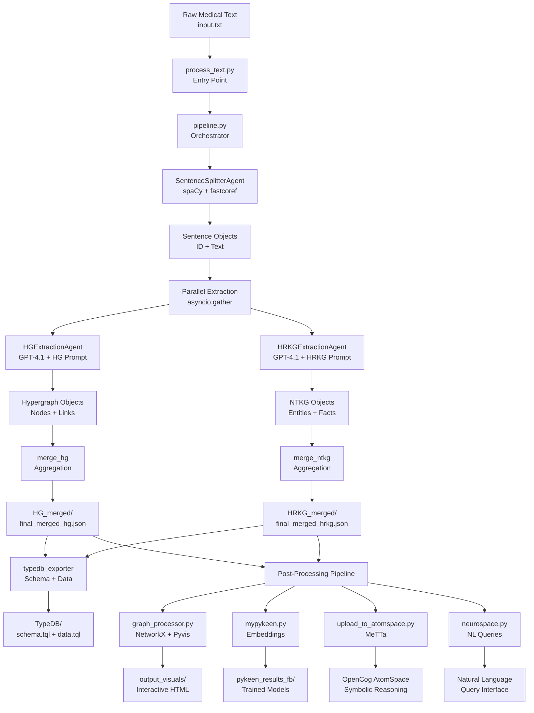

# Healthcare Knowledge Graph Extraction System Architecture

This system is a sophisticated AI-powered pipeline designed to extract structured knowledge from unstructured medical text, producing two complementary graph representations: OpenCog AtomSpace Hypergraphs (HG) and N-tuple Hyper-Relational Temporal Knowledge Graphs (HRKG). The system leverages GPT-4.1 for intelligent extraction and is specifically optimized for healthcare applications and clinical decision support systems (CDSS).

## 🎯 System Purpose

The architecture transforms biomedical literature into machine-readable knowledge representations that enable:
- **Automated Clinical Decision Support** - Real-time drug interaction analysis and treatment recommendations
- **Evidence-Based Medicine** - Systematic literature synthesis and clinical guideline extraction
- **Drug Discovery & Safety** - Mechanism of action modeling and adverse event prediction
- **Precision Medicine** - Biomarker-drug associations and personalized treatment planning
- **Symbolic Reasoning** - Causal inference and logical reasoning over medical knowledge
- **Machine Learning** - Knowledge graph embeddings for predictive modeling

## 🏗️ Architectural Principles

### Dual Knowledge Representation Strategy
The system generates two complementary graph formats to serve different computational paradigms:

1. **OpenCog AtomSpace Hypergraphs (HG)** - For symbolic reasoning and causal inference
   - Supports complex logical operations and rule-based reasoning
   - Enables probabilistic truth value assignments
   - Facilitates integration with cognitive architectures

2. **N-tuple Hyper-Relational Knowledge Graphs (HRKG)** - For machine learning and database applications
   - Optimized for graph neural networks and embedding models
   - Supports temporal relationships and provenance tracking
   - Compatible with standard knowledge graph frameworks

### Parallel Processing Architecture
- **Concurrent Extraction**: HG and HRKG agents run simultaneously on each sentence
- **Asynchronous Processing**: Non-blocking I/O for OpenAI API calls with rate limiting
- **Sentence-Level Granularity**: Individual sentence processing enables fine-grained error handling
- **Intelligent Aggregation**: Graph merging preserves entity consistency across sentences

## 🔧 Core Architecture Components

### 1. Core Extraction Pipeline (`hypergraph_extractor/`)

The heart of the system, orchestrating the transformation of raw medical text into structured knowledge graphs through a sophisticated multi-agent pipeline.

#### Entry Point and Orchestration:

**`process_text.py`** - Command-line entry point:
- Reads input text from `input.txt` or stdin
- Initializes output directory structure (`out_sem_2/`)
- Invokes the main pipeline with document ID tracking
- Handles file I/O and error reporting

**`pipeline.py`** - Asynchronous orchestrator implementing the core workflow:
- **Configuration Loading**: Initializes system settings from `pyproject.toml`
- **Sentence Processing**: Coordinates spaCy-based sentence splitting and coreference resolution
- **Parallel Extraction**: Runs concurrent HG and HRKG extraction using `asyncio.gather()`
- **Graph Aggregation**: Merges sentence-level graphs into document-level representations
- **Multi-Format Export**: Triggers TypeDB, JSON, and MeTTa format generation
- **Error Handling**: Implements robust error recovery and logging

#### Intelligent Agent System:

**`agents.py`** - Multi-agent LLM interaction framework:
- **`SentenceSplitterAgent`**:
  - Uses spaCy SciBERT model (`en_core_sci_scibert`) for biomedical text processing
  - Implements fastcoref for coreference resolution and entity linking
  - Generates sentence objects with unique IDs and cleaned text

- **`LLMExtractionAgent`** (Abstract Base Class):
  - Manages OpenAI GPT-4.1 API communication with exponential backoff
  - Implements JSON extraction and validation from LLM responses
  - Handles rate limiting (3 RPS default) and retry logic (3 attempts)
  - Provides debug output for failed extractions

- **`HGExtractionAgent`** (Inherits from LLMExtractionAgent):
  - Specializes in OpenCog AtomSpace hypergraph extraction
  - Uses `schema_generation_prompt_HG.txt` template
  - Validates output against `Hypergraph` Pydantic model
  - Generates ConceptNodes, PredicateNodes, and EvaluationLinks

- **`HRKGExtractionAgent`** (Inherits from LLMExtractionAgent):
  - Specializes in N-tuple hyper-relational knowledge graph extraction
  - Uses `schema_generation_prompt_HRKG.txt` template
  - Validates output against `NTKG` Pydantic model
  - Generates entities, facts, and temporal relationships

#### Data Models and Validation:

**`models.py`** - Type-safe Pydantic data models:
- **`Sentence`**: Encapsulates sentence ID and cleaned text content
- **`Entity`**: Represents medical entities (Drug, Disease, Biomarker, etc.) with type classification
- **`FactRole`**: Defines entity roles within facts (agent, target, condition, dosage, delta)
- **`Fact`**: N-tuple relationships with predicate, timestamp, truth values, and role-based tuples
- **`NTKG`**: Complete N-tuple knowledge graph with entities and facts collections
- **`Hypergraph`**: AtomSpace-compatible structure with nodes and links
- **`Timestamp`**: Custom date handling with ISO format serialization

#### Graph Processing and Integration:

**`aggregator.py`** - Intelligent graph merging system:
- **Entity Deduplication**: Merges entities across sentences using name-based matching
- **ID Consistency**: Maintains stable entity IDs throughout the aggregation process
- **Relationship Preservation**: Combines facts while preserving temporal and provenance metadata
- **Document-Level Coherence**: Creates unified knowledge graphs from sentence fragments
- **Metadata Integration**: Preserves source document information and extraction timestamps

**`openai_client.py`** - Production-ready API client:
- **Exponential Backoff**: Implements retry logic with increasing delays (2^attempt seconds)
- **Rate Limiting**: Enforces configurable requests per second (default: 3 RPS)
- **Token Management**: Tracks token usage and manages context window limits
- **Error Classification**: Distinguishes between retryable and fatal API errors
- **Async Support**: Non-blocking API calls for concurrent processing

**`config.py`** - Centralized configuration management:
- **TOML Integration**: Loads settings from `[tool.hypergraph-extractor]` section
- **Path Resolution**: Handles absolute and relative paths for prompt templates
- **Model Configuration**: Manages GPT-4.1 parameters (temperature, max tokens, etc.)
- **Validation**: Ensures all required configuration files exist and are readable
- **Agent Settings**: Configures rate limits, retries, and model-specific parameters

**`typedb_exporter.py`** - Database integration layer:
- **Schema Generation**: Creates TypeDB schema definitions from extracted knowledge
- **Data Export**: Converts knowledge graphs to TypeQL insertion queries
- **Relationship Modeling**: Handles complex n-ary relationships and temporal data
- **Type Mapping**: Maps Pydantic models to TypeDB entity and relation types

### 2. Post-Processing and Analysis Pipeline (`hypergraph_extractor/out_sem_2/`)

Comprehensive toolkit for transforming extracted knowledge graphs into various formats and enabling downstream applications.

#### Visualization and Graph Analysis:

**`graph_processor.py`** - Advanced graph visualization system (Version 14):
- **Unified Reified Model**: Processes both HG and HRKG formats with consistent node/edge representation
- **NetworkX Integration**: Converts knowledge graphs to NetworkX MultiDiGraph objects
- **Interactive Visualizations**: Generates Pyvis HTML visualizations with physics simulation
- **Document Hub Architecture**: Creates central document nodes connecting all sentences
- **Graph Metrics**: Computes centrality measures, clustering coefficients, and connectivity statistics
- **Export Capabilities**: Saves graphs in Gpickle and JSON formats for further analysis
- **Tooltip Enhancement**: Includes full sentence text and metadata in interactive visualizations

#### Format Conversion and Database Integration:

**`json2FB.py`** - Freebase triple format converter:
- **Triple Extraction**: Converts complex knowledge graphs to standard subject-predicate-object triples
- **Entity Normalization**: Standardizes entity names and removes special characters
- **Batch Processing**: Handles multiple graph files in sequence
- **CSV Export**: Generates Freebase-compatible CSV files for database import

**`json2tql.py` / `json_to_tql.py`** - TypeDB integration tools:
- **Schema Generation**: Creates TypeDB schema definitions from knowledge graph structure
- **Data Conversion**: Transforms entities and facts into TypeQL insertion queries
- **Relationship Mapping**: Handles complex n-ary relationships and temporal attributes
- **Batch Export**: Processes multiple knowledge graphs for database loading

#### Machine Learning and Embeddings:

**`mypykeen.py`** - Knowledge graph embedding pipeline:
- **Model Training**: Supports TransE, TransD, DistMult, and other embedding models
- **Hyperparameter Optimization**: Uses Optuna with TPE sampler for automated tuning
- **Triple Processing**: Converts knowledge graphs to triple format with entity simplification
- **Evaluation Metrics**: Computes link prediction accuracy and ranking metrics
- **GPU Support**: Configurable CUDA/CPU training with reproducible random seeds
- **Results Management**: Saves trained models and evaluation results in structured directories

#### Symbolic AI and Reasoning:

**`upload_to_atomspace.py`** - OpenCog AtomSpace integration:
- **MeTTa Conversion**: Transforms JSON hypergraphs to MeTTa expression format
- **AtomSpace Loading**: Uploads knowledge graphs to OpenCog for symbolic reasoning
- **Truth Value Mapping**: Preserves probabilistic truth values in AtomSpace format
- **Inference Support**: Enables logical reasoning and rule-based inference over medical knowledge

**`neurospace.py`** - Natural language query interface:
- **LLM-Powered Queries**: Uses GPT-4.1 to translate natural language questions to graph queries
- **MeTTa Integration**: Executes queries against OpenCog AtomSpace using Hyperon
- **Binding Resolution**: Converts query results back to human-readable format
- **Interactive Exploration**: Provides conversational interface for knowledge discovery
- **Error Handling**: Robust parsing of LLM responses with fallback mechanisms

### 3. Prompt Engineering and Knowledge Templates

The system uses sophisticated prompt engineering to guide LLM extraction with domain-specific instructions.

#### Extraction Prompt Templates:

**`schema_generation_prompt_HG.txt`** - OpenCog AtomSpace extraction:
- **Entity Detection**: Identifies Drug, Disease, Endpoint, Biomarker, AdverseEvent, ClinicalAction entities
- **Relationship Classification**: Distinguishes observational vs. causal relationships
- **Truth Value Assignment**: Observational [1.0, 0.9], Causal [0.85, 0.70], Recommendation [0.60, 0.50]
- **AtomSpace Structure**: Generates ConceptNodes, PredicateNodes, EvaluationLinks, ImplicationLinks
- **Monitoring Rules**: Automatically infers monitoring requirements for increased conditions

**`schema_generation_prompt_HRKG.txt`** - N-tuple knowledge graph extraction:
- **Multi-Fact Generation**: Creates Observational, Causal, Recommendation, Investigation, and Implication facts
- **Role-Based Tuples**: Assigns entity roles (agent, target, condition, dosage, delta)
- **Temporal Modeling**: Includes timestamp and provenance tracking
- **Truth Value Scaling**: Uses scalar truth values (0.90 observational, 0.60 recommendation)
- **Modal Verb Detection**: Identifies investigation requirements from "should", "ought", "advise" phrases

#### Reference Examples and Templates:

**`SYSTEM_PROMPT.txt`** - Global system instructions for LLM behavior
**`EXAMPLE_PROMPT.txt`** - Demonstration of expected input/output format
**`hg.json`** - Reference AtomSpace hypergraph with medical entities and relationships
**`hrkg.json`** - Reference N-tuple knowledge graph with complex medical facts
**`trial_1.json`, `trial_2.json`** - Test outputs demonstrating different extraction scenarios

## 🔄 Data Flow Architecture



## 🧠 Knowledge Representation Models

The system implements two complementary knowledge representation paradigms, each optimized for different computational approaches:

### OpenCog AtomSpace Hypergraph (HG) Model

**Structure**: Nodes and Links with probabilistic truth values
- **ConceptNode**: Represents medical entities (drugs, diseases, biomarkers)
- **PredicateNode**: Represents relationships (reduces, increases, causes, requires)
- **NumberNode**: Represents quantitative values (dosages, percentages)
- **TimestampNode**: Represents temporal information
- **EvaluationLink**: Connects predicates to their arguments
- **ImplicationLink**: Represents causal relationships
- **ContextLink**: Provides temporal and provenance context

**Truth Values**: Probabilistic confidence and strength pairs
- Observational facts: [1.0, 0.9] (high confidence, high strength)
- Causal relationships: [0.85, 0.70] (moderate confidence, good strength)
- Recommendations: [0.60, 0.50] (lower confidence, moderate strength)

**Example Structure**:
```json
{
  "nodes": [
    {"id": "n_vem", "atom_type": "ConceptNode", "name": "Vemurafenib"},
    {"id": "n_reduces", "atom_type": "PredicateNode", "name": "reduces"}
  ],
  "links": [
    {
      "id": "l_effect",
      "link_type": "EvaluationLink",
      "predicate": "n_reduces",
      "arguments": ["n_vem", "n_tumor_vol"],
      "truth_value": [0.95, 0.85]
    }
  ]
}
```

### N-tuple Hyper-Relational Knowledge Graph (HRKG) Model

**Structure**: Entities and Facts with role-based relationships
- **Entities**: Typed medical concepts (Drug, Disease, Endpoint, AdverseEvent, etc.)
- **Facts**: N-tuple relationships with predicate and role assignments
- **FactRoles**: Entity roles within facts (agent, target, condition, dosage, delta)
- **Temporal Attributes**: Timestamps and provenance tracking
- **Truth Values**: Scalar confidence scores

**Fact Types**:
- **therapy_effect**: Drug efficacy relationships
- **adverse_effect**: Side effect associations
- **requires_monitoring**: Monitoring recommendations
- **requires_investigation**: Investigation requirements
- **implies**: Higher-order logical implications

**Example Structure**:
```json
{
  "entities": [
    {"id": "E1", "name": "Vemurafenib", "type": "Drug"},
    {"id": "E2", "name": "Tumor volume", "type": "Endpoint"}
  ],
  "facts": [
    {
      "id": "F1",
      "predicate": "therapy_effect",
      "timestamp": "2023-01-01",
      "truth_value": 0.90,
      "tuple": [
        {"entity": "E1", "role": "agent"},
        {"entity": "E2", "role": "target"},
        {"literal": -60, "datatype": "percent", "role": "delta"}
      ]
    }
  ]
}
```

### Hypergraph (HG) - AtomSpace Format
- **Purpose**: Symbolic AI and reasoning applications
- **Structure**: Nodes (ConceptNode, PredicateNode) and Links (EvaluationLink, ImplicationLink)
- **Features**: Truth values, temporal context, provenance tracking
- **Use Cases**: OpenCog reasoning, symbolic inference, causal modeling

### Hyper-Relational Knowledge Graph (HRKG) - N-tuple Format
- **Purpose**: Traditional KG applications and machine learning
- **Structure**: Entities with typed relationships and temporal qualifiers
- **Features**: N-ary relations, temporal validity, uncertainty modeling
- **Use Cases**: Neo4j storage, embedding training, SPARQL queries

## ⚙️ Processing Workflow

### Phase 1: Setup and Configuration
1. **Environment Setup**: Configure OpenAI API key and install dependencies
2. **Configuration**: Set parameters in `pyproject.toml` (model, prompts, rate limits)
3. **Input Preparation**: Place medical text in `input.txt` or prepare for stdin input

### Phase 2: Core Extraction Pipeline
1. **Text Preprocessing**:
   - Sentence splitting using spaCy SciBERT model
   - Coreference resolution with fastcoref
   - Generation of sentence objects with unique IDs

2. **Parallel Knowledge Extraction**:
   - Concurrent execution of HG and HRKG extraction agents
   - GPT-4.1 API calls with rate limiting and retry logic
   - JSON validation against Pydantic models
   - Per-sentence debug output for failed extractions

3. **Graph Aggregation**:
   - Entity deduplication across sentences
   - Fact merging with provenance preservation
   - Document-level graph construction
   - Export to multiple formats (JSON, TypeDB, MeTTa)

### Phase 3: Post-Processing and Analysis
1. **Format Conversion**:
   ```bash
   cd hypergraph_extractor/out_sem_2
   python json2FB.py          # Convert to Freebase triples
   python json2tql.py         # Generate TypeDB schema/data
   ```

2. **Visualization Generation**:
   ```bash
   python graph_processor.py  # Create interactive HTML visualizations
   ```

3. **Machine Learning Pipeline**:
   ```bash
   python mypykeen.py         # Train knowledge graph embeddings
   ```

4. **Symbolic AI Integration**:
   ```bash
   python upload_to_atomspace.py  # Load into OpenCog AtomSpace
   ```

5. **Natural Language Queries**:
   ```bash
   python neurospace.py       # Interactive query interface
   ```

### Phase 4: Application Integration
- **Clinical Decision Support**: Query for drug interactions and recommendations
- **Research Analysis**: Explore relationships and generate hypotheses
- **Database Integration**: Load into TypeDB or Neo4j for production use
- **ML Model Training**: Use embeddings for downstream prediction tasks

## 📁 Output Directory Structure

```
hypergraph_extractor/out_sem_2/
├── HG_merged/                           # OpenCog AtomSpace outputs
│   ├── final_merged_hg.json            # Complete hypergraph
│   ├── final_merged_hg.metta           # MeTTa format for OpenCog
│   ├── final_merged_hg_inline.json     # Inline format variant
│   ├── hg_entities_facts_literals_mapping.tsv  # Entity mappings
│   └── hg_triples.txt                  # Triple format
├── HRKG_merged/                         # N-tuple knowledge graphs
│   ├── final_merged_hrkg.json          # Complete HRKG
│   ├── final_merged_hrkg_inline.json   # Inline format variant
│   ├── hrkg_entities_facts_literals_mapping.tsv  # Entity mappings
│   ├── hrkg_triples.txt                # Standard triples
│   └── hrkg_stripped_triples.txt       # Simplified triples
├── TypeDB/                              # Database exports
│   ├── schema.tql                      # TypeDB schema definition
│   └── data.tql                        # TypeDB data insertion queries
├── per_sentence_outputs/                # Individual sentence extractions
│   ├── SENT_1_hg.json                  # Per-sentence hypergraphs
│   ├── SENT_1_hrkg.json                # Per-sentence HRKGs
│   └── ...                             # Additional sentence outputs
├── output_visuals/                      # Interactive visualizations
│   ├── final_merged_hg_interactive.html      # HG visualization
│   ├── final_merged_hrkg_interactive.html    # HRKG visualization
│   └── ...                             # Additional visual outputs
├── output_files/                        # NetworkX graph objects
│   ├── final_merged_hg.gpickle         # Serialized NetworkX graphs
│   ├── final_merged_hg_graph.json      # JSON graph representations
│   └── ...                             # Additional graph files
├── pykeen_results_fb/                   # ML embedding results
│   ├── best_pipeline/                  # Best performing model
│   ├── study.json                      # Hyperparameter optimization results
│   └── trials.tsv                      # Training trial data
├── data/                                # Embedding data
│   ├── natural_space_embedings/        # Natural language embeddings
│   └── qa_space_embedings/             # Q&A embeddings
├── tql/                                 # Additional TypeDB exports
├── lib/                                 # Visualization libraries
└── debug/                               # Extraction debug logs
    ├── debug_HGExtractionAgent_*.txt   # HG extraction debugging
    └── debug_HRKGExtractionAgent_*.txt # HRKG extraction debugging
```

## Configuration and Customization

### Key Configuration Files:
- `pyproject.toml`: Main configuration including prompts, models, and parameters
- Schema prompts: Customizable extraction templates for different domains

### Extraction Prompts:
- **HG Prompt**: Optimized for OpenCog AtomSpace representation
- **HRKG Prompt**: Optimized for relational knowledge graphs
- Both support medical entity recognition and relationship extraction

## Integration Points

### Database Systems:
- **TypeDB**: Native support via TypeQL export
- **Neo4j**: CSV export for bulk import
- **OpenCog AtomSpace**: Direct integration via upload scripts

### Machine Learning:
- **PyKEEN**: Knowledge graph embedding training
- **Custom Models**: Extensible framework for additional ML integration

### Visualization:
- **NetworkX**: Graph analysis and metrics
- **Pyvis**: Interactive web-based visualization
- **Custom Dashboards**: Extensible visualization framework

## Usage Workflow

1. **Setup**: Configure `pyproject.toml` with API keys and parameters
2. **Input**: Place medical text in designated input file
3. **Extraction**: Run `python hypergraph_extractor/process_text.py`
4. **Processing**: Execute post-processing scripts in sequence:
   - `json2FB.py` → `graph_processor.py` → `upload_to_atomspace.py`
5. **Analysis**: Use `neurospace.py` for natural language queries
6. **ML Training**: Run `mypykeen.py` for embedding generation

## 🔬 Research Applications and Use Cases

### Clinical Decision Support Systems (CDSS)
- **Drug Interaction Analysis**: Automated detection of contraindications and adverse combinations
- **Treatment Recommendations**: Evidence-based therapy suggestions based on patient conditions
- **Risk Stratification**: Identification of high-risk patients requiring monitoring
- **Dosage Optimization**: Personalized dosing recommendations based on biomarkers

### Evidence-Based Medicine
- **Literature Synthesis**: Automated extraction and aggregation of clinical evidence
- **Clinical Guideline Generation**: Systematic review of treatment protocols
- **Meta-Analysis Support**: Quantitative synthesis of research findings
- **Systematic Review Automation**: Large-scale evidence evaluation

### Drug Discovery and Safety
- **Mechanism of Action Modeling**: Understanding drug-target interactions
- **Adverse Event Prediction**: Early identification of potential side effects
- **Drug Repurposing**: Discovery of new therapeutic applications
- **Safety Profile Analysis**: Comprehensive risk assessment across populations

### Precision Medicine
- **Biomarker-Drug Associations**: Personalized therapy selection
- **Patient Stratification**: Identification of treatment-responsive subgroups
- **Pharmacogenomics**: Genetic factors in drug response
- **Personalized Treatment Plans**: Individualized therapy optimization

### Symbolic AI and Reasoning
- **Causal Inference**: Understanding cause-effect relationships in medicine
- **Logical Reasoning**: Rule-based medical decision making
- **Knowledge Integration**: Combining multiple sources of medical evidence
- **Hypothesis Generation**: Automated discovery of research questions

## 🛠️ Technical Requirements and Performance

### Core Dependencies
- **Python 3.10+**: Required runtime environment
- **OpenAI API**: GPT-4.1 for knowledge extraction (requires API key)
- **spaCy + SciBERT**: Biomedical NLP processing (`en_core_sci_scibert`)
- **Pydantic 2.7+**: Type-safe data validation and serialization
- **fastcoref**: Coreference resolution for entity linking
- **asyncio**: Asynchronous processing for concurrent API calls

### Visualization and Analysis
- **NetworkX**: Graph analysis and manipulation
- **Pyvis**: Interactive HTML visualizations with physics simulation
- **Pandas**: Data processing and CSV export
- **NumPy**: Numerical computations for embeddings

### Database Integration
- **TypeDB**: Graph database with complex relationship modeling
- **Neo4j**: Alternative graph database (CSV import support)
- **JSON/CSV**: Standard data interchange formats

### Machine Learning
- **PyKEEN**: Knowledge graph embedding framework
- **PyTorch**: Deep learning backend for embeddings
- **Optuna**: Hyperparameter optimization
- **scikit-learn**: Additional ML utilities

### Symbolic AI
- **OpenCog**: Symbolic reasoning engine
- **Hyperon**: MeTTa language support for OpenCog
- **Truth value logic**: Probabilistic reasoning capabilities

### Performance Characteristics
- **Processing Speed**: ~50 sentences/minute (depends on API rate limits)
- **Concurrent Extraction**: Parallel HG and HRKG generation
- **Rate Limiting**: 3 RPS default (configurable)
- **Memory Efficiency**: Sentence-level processing with streaming aggregation
- **Error Recovery**: Robust retry logic with exponential backoff
- **Scalability**: Handles documents from single sentences to full papers

### System Requirements
- **Memory**: 4GB+ RAM recommended for large documents
- **Storage**: Variable (depends on output formats and visualizations)
- **Network**: Stable internet connection for OpenAI API
- **CPU**: Multi-core recommended for parallel processing

## 🚀 Future Extensions and Roadmap

### Planned Enhancements

#### Domain Expansion
- **Specialized Medical Domains**: Oncology, cardiology, neurology-specific extraction agents
- **Multi-Language Support**: Non-English medical literature processing
- **Clinical Trial Integration**: Structured extraction from trial protocols and results
- **Regulatory Document Processing**: FDA, EMA guideline extraction

#### Technical Improvements
- **Real-Time Processing**: Streaming pipeline for continuous literature monitoring
- **Multi-Modal Extraction**: Integration of images, tables, and figures
- **Enhanced Reasoning**: Advanced causal inference and uncertainty quantification
- **Federated Learning**: Distributed knowledge graph construction

#### Integration Capabilities
- **FHIR Compatibility**: Healthcare data standard integration
- **Electronic Health Records**: Direct EHR system integration
- **Clinical Workflow**: Integration with hospital information systems
- **Research Platforms**: Connection to PubMed, ClinicalTrials.gov APIs

#### Performance Optimizations
- **GPU Acceleration**: CUDA support for embedding training
- **Distributed Processing**: Multi-node cluster support
- **Caching Systems**: Intelligent caching for repeated extractions
- **Incremental Updates**: Delta processing for updated literature

### Extensibility Features

The architecture supports easy extension through:
- **Plugin Architecture**: Modular agent system for new extraction types
- **Configuration-Driven**: TOML-based configuration for new models and prompts
- **API Abstraction**: Support for multiple LLM providers (Anthropic, local models)
- **Output Format Plugins**: Easy addition of new export formats
- **Custom Visualization**: Extensible visualization framework

### Research Directions
- **Automated Hypothesis Generation**: AI-driven research question formulation
- **Causal Discovery**: Advanced causal inference from observational data
- **Temporal Reasoning**: Time-series analysis of medical knowledge evolution
- **Uncertainty Quantification**: Probabilistic reasoning over medical evidence
- **Explainable AI**: Interpretable knowledge extraction and reasoning

## 🎯 System Contributions and Innovation

### Novel Architectural Features

#### Dual Knowledge Representation
- **First-of-its-kind**: Simultaneous generation of symbolic (AtomSpace) and relational (HRKG) representations
- **Complementary Strengths**: Combines symbolic reasoning with machine learning capabilities
- **Unified Pipeline**: Single extraction process produces both formats without redundancy

#### Healthcare-Optimized Extraction
- **Domain-Specific Prompts**: Specialized templates for medical entity and relationship extraction
- **Truth Value Engineering**: Sophisticated confidence scoring for different fact types
- **Temporal Modeling**: Built-in support for time-aware medical relationships
- **Provenance Tracking**: Complete lineage from source text to extracted knowledge

#### Production-Ready Architecture
- **Robust Error Handling**: Comprehensive retry logic and graceful degradation
- **Scalable Processing**: Asynchronous, rate-limited API interactions
- **Comprehensive Output**: Multiple export formats for different use cases
- **Debugging Support**: Detailed logging and debug output for troubleshooting

### Impact on Healthcare AI

#### Clinical Decision Support
- **Evidence Integration**: Automated synthesis of medical literature for clinical guidelines
- **Risk Assessment**: Systematic identification of drug interactions and monitoring requirements
- **Personalized Medicine**: Biomarker-drug association discovery for precision therapy

#### Research Acceleration
- **Literature Mining**: Large-scale extraction from biomedical publications
- **Knowledge Discovery**: Automated identification of novel relationships
- **Hypothesis Generation**: AI-assisted research question formulation

#### Symbolic-Neural Integration
- **Hybrid AI**: Bridges symbolic reasoning and neural network approaches
- **Interpretable AI**: Maintains explainability while leveraging deep learning
- **Causal Reasoning**: Enables sophisticated causal inference in medical domains

This architecture represents a significant advancement in automated biomedical knowledge extraction, providing a robust, scalable, and production-ready system for transforming unstructured medical literature into actionable knowledge graphs.

## Debug and Monitoring

The system includes comprehensive debugging:
- Per-sentence extraction logs in `out_sem_2/debug/`
- Retry attempt tracking
- Token usage monitoring
- Graph validation and consistency checks
- Performance metrics and timing analysis

