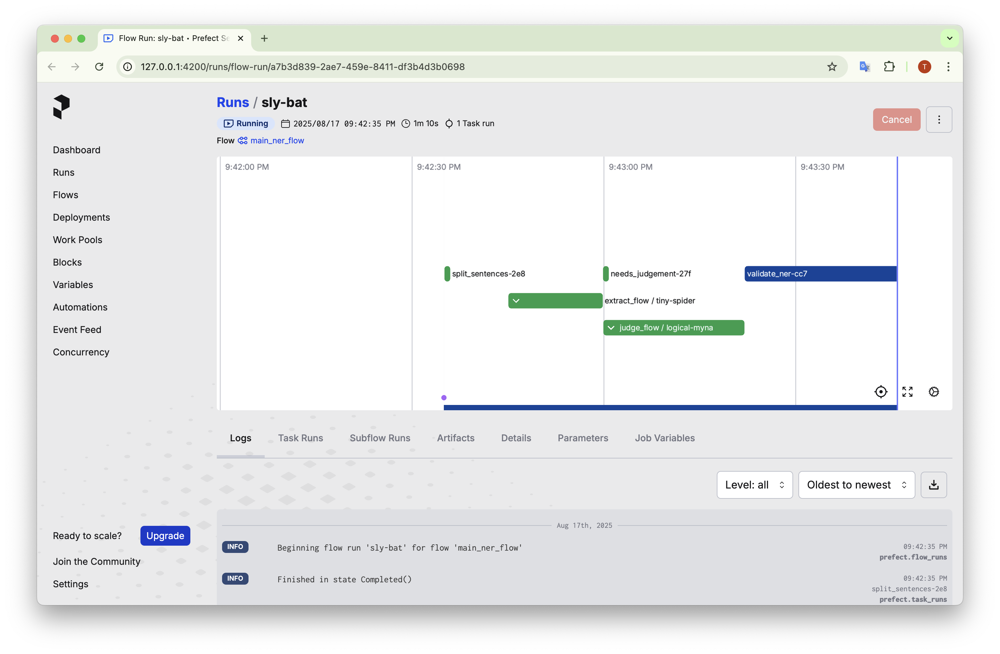

# Medical UMLS NER Agentic Pipeline

An agentic workflow for advanced medical Named Entity Recognition (NER) that combines:

* LLM-based extraction (primary NER pass)
* An LLM judge for iterative quality improvement
* Automated span validation / correction loops
* DSPy programmatic prompting + optimization / few‑shot bootstrapping
* LangGraph to orchestrate control flow
* Prefect for task execution & observability
* UMLS semantic typing and normalization targets
* WebAnno TSV 3.3 compatible import/export (usable with INCEpTION / WebAnno)



---

## 1. Quick Start

### Prerequisites

* Python (project managed with [uv](https://github.com/astral-sh/uv))
* spaCy + SciSpaCy model (`en_core_sci_sm`)
* Access to the LLM providers whose APIs you configure (e.g. OpenAI, Anthropic, etc.)
* Prefect (local server) running before execution

### Environment Setup (uv)

```bash
# Create & sync environment
uv sync

# (If needed) install SciSpaCy model
uv pip install https://s3-us-west-2.amazonaws.com/ai2-s2-scispacy/releases/v0.4.0/en_core_sci_sm-0.4.0.tar.gz
```

### .env File

Create a `.env` in the project root with required API keys. Example (adjust to your providers):

```bash
OPENAI_API_KEY=sk-...
ANTHROPIC_API_KEY=...
COHERE_API_KEY=...
HF_API_TOKEN=...
```

The code will read these via your chosen configuration layer (e.g. `os.environ`). Only include the keys you actually use.

### Start Prefect Server (must be running first)

```bash
prefect server start
```

### Run Pipeline

```bash
uv run python graph.py
```

Outputs are written to:

* `ner_output.json` – serialized full state
* `ner_annotations.tsv` – validated NER spans (WebAnno TSV 3.3)

---

## 2. Agentic Graph (LangGraph + Prefect)

Core orchestration lives in `graph.py`. The graph wires modular tasks (sentence splitting, semantic chunking, extraction, judging, validation, persistence). Conditional branching decides whether to invoke the judge or proceed directly to validation.

```python
def build_graph() -> CompiledStateGraph:
	gb = StateGraph(NerState)

	gb.add_node("ner", ner_task)
	gb.add_node("semantic_chunk", semantic_chunk)
	gb.add_node("split_sentences", split_sentences)
	gb.add_node("judge", judge)
	gb.add_node("save_output", save_output)
	gb.add_node("validate_ner", validate_ner)
	gb.add_node("needs_judgement", needs_judgement)

	gb.add_edge(START, "split_sentences")
	gb.add_edge("split_sentences", "semantic_chunk")
	gb.add_edge("semantic_chunk", "ner")
	gb.add_conditional_edges(
		"ner", needs_judgement, {k: k for k in ("judge", "validate_ner")}
	)
	gb.add_edge("judge", "validate_ner")
	gb.add_edge("validate_ner", "save_output")
	gb.add_edge("save_output", END)

	return gb.compile()
```

Flow summary:
1. `split_sentences` – newline based segmentation + tokenization (SciSpaCy)
2. `semantic_chunk` – groups related sentences (LLM) to form paragraphs for batch NER
3. `ner` – primary extraction (LLM few-shot via DSPy)
4. `needs_judgement` – branching function
5. `judge` – quality review & correction (LLM with explicit rules)
6. `validate_ner` – deterministic validation / iterative repair loop
7. `save_output` – serialize JSON + export WebAnno TSV

Prefect tasks are decorated (`@task` / `@flow`) enabling retries, logging, and observability on the Prefect UI.

---

## 3. DSPy Optimization

The project integrates DSPy modules:

* Bootstrapped few‑shot example generation (`BootstrapFewShot`, `MIPROv2`, etc.)
* Custom metric: macro-averaged precision / recall / F1 over span sets
* Demo persistence in `optimized_ner_demos.json`

Typical optimization (simplified):

```python
teleprompter = MIPROv2(metric=dspy_ner_metric_implementation_corrected, auto="heavy")
optimized = teleprompter.compile(student=ExtractModule(), trainset=train, valset=val)
save_optimized_program_demos(optimized, "optimized_ner_demos.json")
```

---

## 4. TSV Format & INCEpTION Compatibility

`ner_annotations.tsv` follows WebAnno TSV 3.3:

* `#FORMAT=WebAnno TSV 3.3` header
* One line per token: `sentId-tokenId\tstart-end\ttoken\tLABEL[spanId]`
* Contiguous identical span IDs form multi-token spans
* Unannotated tokens use `_`

You can open the exported TSV in [INCEpTION](https://inception-project.github.io/) for manual review / correction.

Import path:

1. Project → Import Source Document → Format: WebAnno TSV 3.3
2. Upload `ner_annotations.tsv`

---

## 5. UMLS Integration

Labels (e.g. `FINDING_T033`, `LABORATORY_PROCEDURE_T059`) reflect UMLS semantic types. The judge step encourages normalization to preferred terms (`umls_pref_label`) where unambiguous; non-normalizable descriptive spans remain with `umls_pref_label = null`.

---

## 6. Evaluation

Gold vs predicted spans can be compared via:

```python
stats = calculate_ner_metrics(gold, pred)
```

Metric includes macro-averaged precision, recall, F1 plus per-label breakdown.

To load gold / predicted:

```python
gold = load_from_tsv("./gold/ner_annotations_corrected.tsv")
pred  = load_from_tsv("./output/ner_annotations.tsv")
```

### Additional Runtime Details (from `graph.py`)

**Macro Metrics:** `calculate_ner_metrics_with_output` computes per-sentence precision / recall / F1 then macro-averages. Per-label TP/FP/FN are still accumulated for semantic type reports.

**Diff Helper:** `diff(gold, pred)` prints mismatched spans (index + predicted vs gold) to aid rapid error inspection.

**Validation / Auto-Repair Loop:** `validate_ner` attempts up to 4 passes (initial + 3 retries). Each failed pass constructs a structured error message (index errors, boundary mismatches, text mismatches) fed back through the `previous_run` field to the extraction model so the LLM can correct spans deterministically.

**Branching:** `needs_judgement` currently always returns `"judge"` forcing a quality assurance pass. Replace this with a confidence heuristic later to skip judging when unnecessary.

**Cost Tracking:** Each LLM wrapper (`ExtractModule`, `JudgeModule`) inherits from `LLMModule` which sums per-call cost in `lm.history`. Costs are printed before and after evaluation (extraction vs judge) in the `__main__` block.

**Entry Flow:** `invoke_graph(initial_state: NerState)` (Prefect flow) calls `graph.invoke(initial_state)` on the LangGraph compiled state machine. The `__main__` block reads `data/sample.txt`, builds `NerState(source_text=...)`, executes the flow, then loads gold and predicted TSV files for evaluation and diff output.

**Export:** `save_output` writes both a JSON state dump and a WebAnno TSV (`ner_annotations.tsv`) ready for INCEpTION import.

---

## 7. Project Structure (abridged)

```text
data/                 # Input raw text (sample.txt)
gold/                 # Gold standard TSV
output/               # Generated artifacts
graph.py              # Core pipeline, tasks, metrics, evaluation
main.py               # (removed) Entry point invoking the graph
README.md             # This file
```

---

## 8. Troubleshooting

| Issue | Hint |
|-------|------|
| SciSpaCy model not found | Re-run the model install command (see setup). |
| Prefect UI empty | Confirm `prefect server start` is still running. |
| API auth errors | Verify `.env` variables exported into runtime environment. |
| Empty TSV output | Check that `validate_ner` produced spans; inspect `ner_output.json`. |

---

## 9. Future Enhancements

* Add CUI linking service integration (Metathesaurus lookups)
* Active learning loop with human adjudication feedback
* Multi-model ensemble voting prior to judge step
* Span overlap conflict resolution strategies

---

## 10. License / Compliance

Ensure any deployment complies with clinical data handling policies (HIPAA / GDPR where applicable). This repository processes text only; responsibility for de-identification rests with the data provider.

---

## 11. Minimal End-to-End Run (Recap)

```bash
uv sync
prefect server start   # in a separate terminal
echo "OPENAI_API_KEY=..." > .env  # plus any other keys
uv run python graph.py   # runs __main__ section in graph.py
```

Review results in `ner_annotations.tsv` or load into INCEpTION for inspection.

---

## Citation

If you use components of this pipeline in academic work, please cite relevant tooling (LangGraph, Prefect, DSPy, SciSpaCy, UMLS) per their licenses.

